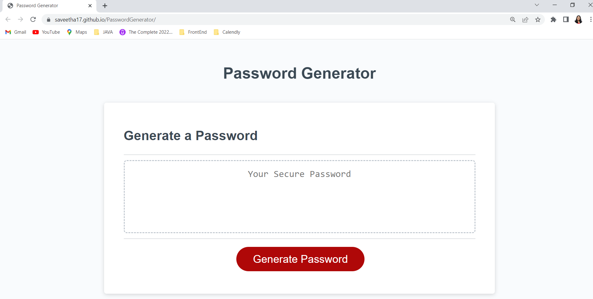

# PasswordGenerator

## Description

Password Generator is an website application that generates a random password which provides greater security to access sensitive data.When user clicks the  generate password button then a series of prompts for password criteria like length of the password, lowercase, uppercase,numeric, and/or special characters has to be entered. When all prompts are answered, a password is generated that matches the selected criteria

## Technologies Used

 * JavaScript
 * Node.js
 * NPM
 * OOP Concepts

## Screen Shot

 

## Link to Github Repository
https://github.com/saveetha17/PasswordGenerator.git

## Link to Deployed Application
https://saveetha17.github.io/PasswordGenerator/
